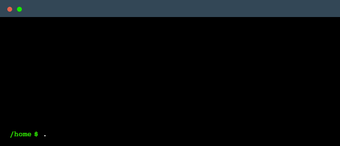

<p align="center">
  
</p>


<p align="center">
  
</p>

<p align="center"> 
  Visitor count<br>
  
</p>

```yaml
while(alive) 
{
   eat();
   sleep();
   code();
   repeat();
}
```


<h3 align="center">A passionate CS student 👨‍💻 at PSU (Portland State University) </h3>

- 🔭 I’m currently working on **Developing a Libyan/Global recepies android app**

- 🌱 I’m currently learning **Front-End and Databases**

- 🤝 I’m looking for help with **Open-Source Projects**

<h3 align="left">Connect with me:</h3>
<p align="center">
<a href="https://twitter.com/raad_elm" target="blank"></a>
<a href="https://www.linkedin.com/in/raad-elmsellati-039b62207/" target="blank"></a>
<a href="https://www.facebook.com/profile.php?id=100006084790743" target="blank"></a>
<a href="https://instagram.com/r3dmsellati" target="blank"></a>
</p>

<h3 align="left">Languages and Tools:</h3>
<p align="center"> <a href="https://developer.android.com" target="_blank" rel="noreferrer">  </a> <a href="https://www.cprogramming.com/" target="_blank" rel="noreferrer">  </a> <a href="https://www.w3schools.com/cpp/" target="_blank" rel="noreferrer">  </a> <a href="https://www.w3schools.com/css/" target="_blank" rel="noreferrer">  </a> <a href="https://www.figma.com/" target="_blank" rel="noreferrer">  </a> <a href="https://firebase.google.com/" target="_blank" rel="noreferrer">  </a> <a href="https://git-scm.com/" target="_blank" rel="noreferrer">  </a> <a href="https://www.w3.org/html/" target="_blank" rel="noreferrer">  </a> <a href="https://www.java.com" target="_blank" rel="noreferrer">  </a> <a href="https://developer.mozilla.org/en-US/docs/Web/JavaScript" target="_blank" rel="noreferrer">  </a> <a href="https://www.linux.org/" target="_blank" rel="noreferrer">  </a> <a href="https://www.photoshop.com/en" target="_blank" rel="noreferrer">  </a> <a href="https://www.php.net" target="_blank" rel="noreferrer">  </a> <a href="https://www.python.org" target="_blank" rel="noreferrer">  </a> </p>
<p align="center">  </p>
<br>
<br>
- Credits: <a href="https://github.com/raadelmsellati" target="blank"> raadelmsellati </a>
